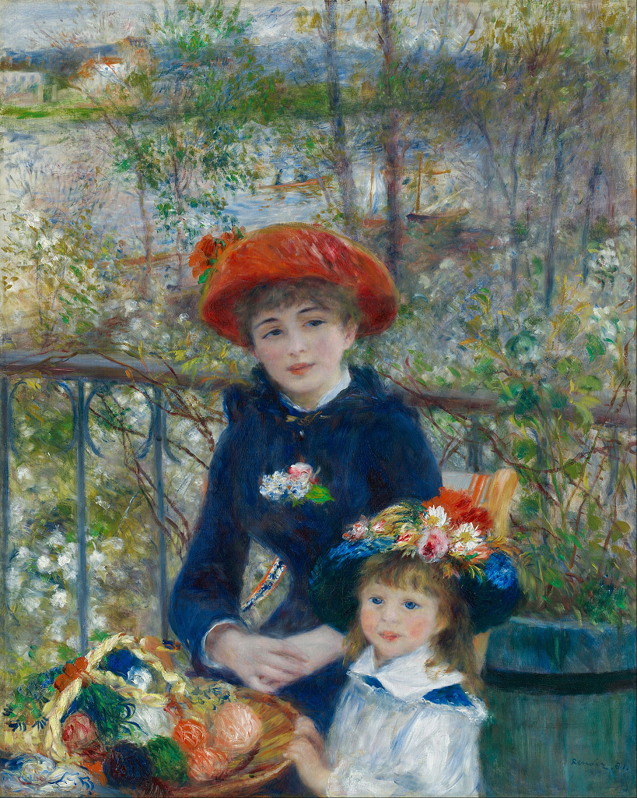
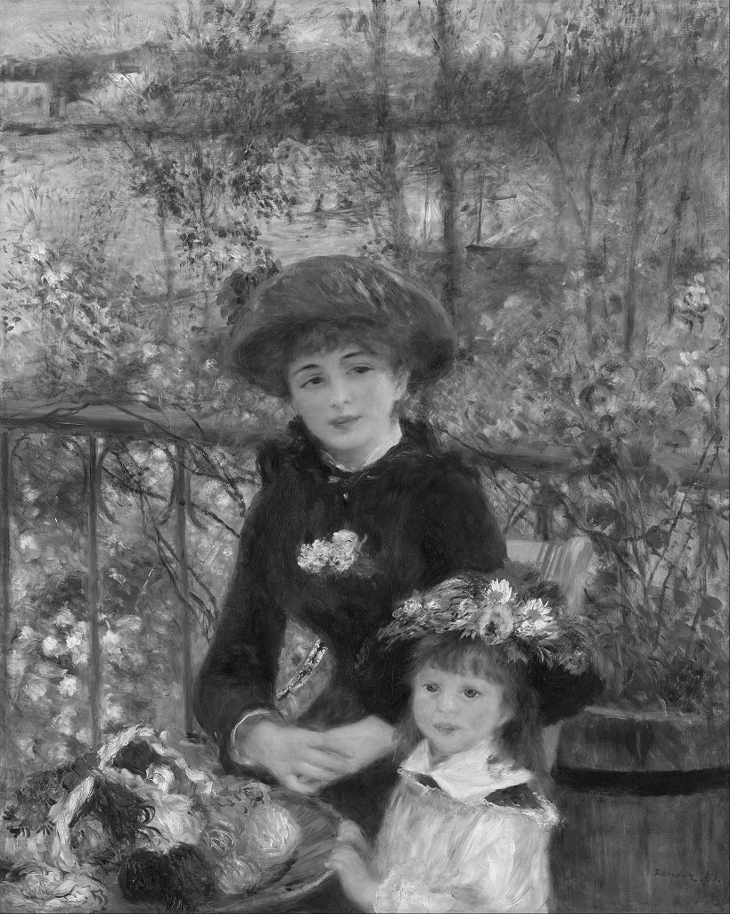

# OpenMPを使ってみた
コンピュータ概論IIの課題です。

画像を加工するテストアプリケーションのプログラムを作成しました。
ただし、処理が並列化されていないので遅いです。
OpenMPを使って並列化してください。

# やっていること
元の画像から

白黒とぼけた絵を作ります

# 進め方
* 本リポジトリをforkしてください
* リポジトリをローカルにダウンロードしてください
* ターミナルからコマンドを打ち込んでください
  * git submodule init
  * git submodule update
* Visual Studio 2022でソリューションを立ち上げてください。
* OpenMP_test.cppを書き換えて並列化してください。
* 更新内容をコミットしてください
* コミットした結果をGitHubにプッシュしてください
* 本リポジトリにプルリクエストをしてください
